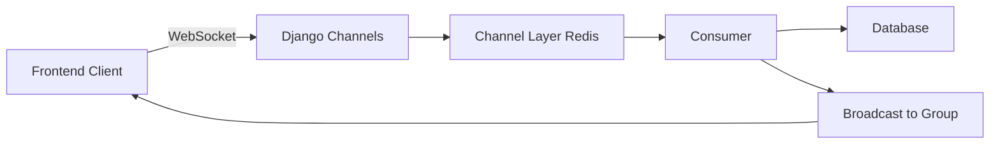

# WebSocket Implementation Guide - Real-time Chat with Django Channels

## Overview

This guide provides complete implementation for adding WebSocket support to your Django chat backend using **Django Channels**. This enables real-time messaging without polling.

---

## Architecture Overview



**Key Components:**
- **Channels**: Extends Django to handle WebSockets
- **Consumers**: WebSocket equivalent of Django views
- **Channel Layer**: Message broker (Redis) for inter-process communication
- **Groups**: Broadcast messages to multiple clients

---

## Step 1: Install Dependencies

### Update requirements.txt

Add these lines to [requirements.txt](file:///c:/Users/lenovo/Desktop/MyProject/chatapp/backend/requirements.txt):

```txt
channels==4.0.0
channels-redis==4.1.0
daphne==4.0.0
```

### Install packages

```bash
pip install channels==4.0.0 channels-redis==4.1.0 daphne==4.0.0
```

### Install Redis

**Windows:**
```bash
# Using Chocolatey
choco install redis-64

# Or download from: https://github.com/microsoftarchive/redis/releases
```

**Linux/Mac:**
```bash
# Ubuntu/Debian
sudo apt-get install redis-server

# Mac
brew install redis
```

**Start Redis:**
```bash
redis-server
```

---

## Step 2: Update Django Settings

### Modify [chatproject/settings.py](file:///c:/Users/lenovo/Desktop/MyProject/chatapp/backend/chatproject/settings.py)

```python
# Add to INSTALLED_APPS (add 'daphne' at the TOP)
INSTALLED_APPS = [
    'daphne',  # Must be first!
    'django.contrib.admin',
    'django.contrib.auth',
    'django.contrib.contenttypes',
    'django.contrib.sessions',
    'django.contrib.messages',
    'django.contrib.staticfiles',
    'rest_framework',
    'rest_framework_simplejwt.token_blacklist',
    'corsheaders',
    'chatapp',
]

# Add ASGI application configuration
ASGI_APPLICATION = 'chatproject.asgi.application'

# Configure Channel Layers (Redis)
CHANNEL_LAYERS = {
    'default': {
        'BACKEND': 'channels_redis.core.RedisChannelLayer',
        'CONFIG': {
            "hosts": [('127.0.0.1', 6379)],
        },
    },
}

# For development/testing without Redis, use in-memory layer (NOT for production):
# CHANNEL_LAYERS = {
#     "default": {
#         "BACKEND": "channels.layers.InMemoryChannelLayer"
#     }
# }
```

---

## Step 3: Configure ASGI

### Update [chatproject/asgi.py](file:///c:/Users/lenovo/Desktop/MyProject/chatapp/backend/chatproject/asgi.py)

Replace the entire file with:

```python
import os
from django.core.asgi import get_asgi_application
from channels.routing import ProtocolTypeRouter, URLRouter
from channels.auth import AuthMiddlewareStack
from channels.security.websocket import AllowedHostsOriginValidator

os.environ.setdefault('DJANGO_SETTINGS_MODULE', 'chatproject.settings')

# Initialize Django ASGI application early
django_asgi_app = get_asgi_application()

# Import after Django setup
from chatapp.routing import websocket_urlpatterns

application = ProtocolTypeRouter({
    "http": django_asgi_app,
    "websocket": AllowedHostsOriginValidator(
        AuthMiddlewareStack(
            URLRouter(websocket_urlpatterns)
        )
    ),
})
```

---

## Step 4: Create WebSocket Consumer

### Create `chatapp/consumers.py`

```python
import json
from channels.generic.websocket import AsyncWebsocketConsumer
from channels.db import database_sync_to_async
from django.contrib.auth import get_user_model
from .models import Conversation, Message, ConversationParticipant, MessageDeletion
from .serializers import MessageSerializer

User = get_user_model()


class ChatConsumer(AsyncWebsocketConsumer):
    """
    WebSocket consumer for real-time chat messaging.
    
    URL: ws://localhost:8000/ws/chat/<conversation_id>/
    """

    async def connect(self):
        """Handle WebSocket connection"""
        self.conversation_id = self.scope['url_route']['kwargs']['conversation_id']
        self.room_group_name = f'chat_{self.conversation_id}'
        self.user = self.scope['user']

        # Reject anonymous users
        if self.user.is_anonymous:
            await self.close(code=4001)
            return

        # Verify user is participant in this conversation
        is_participant = await self.check_participant()
        if not is_participant:
            await self.close(code=4003)
            return

        # Join room group
        await self.channel_layer.group_add(
            self.room_group_name,
            self.channel_name
        )

        await self.accept()

        # Send connection confirmation
        await self.send(text_data=json.dumps({
            'type': 'connection_established',
            'message': 'Connected to chat'
        }))

    async def disconnect(self, close_code):
        """Handle WebSocket disconnection"""
        # Leave room group
        if hasattr(self, 'room_group_name'):
            await self.channel_layer.group_discard(
                self.room_group_name,
                self.channel_name
            )

    async def receive(self, text_data):
        """
        Receive message from WebSocket client
        
        Expected format:
        {
            "type": "chat_message",
            "content": "Hello world"
        }
        
        OR
        
        {
            "type": "delete_message",
            "message_id": 123
        }
        
        OR
        
        {
            "type": "typing",
            "is_typing": true
        }
        """
        try:
            data = json.loads(text_data)
            message_type = data.get('type')

            if message_type == 'chat_message':
                await self.handle_chat_message(data)
            elif message_type == 'delete_message':
                await self.handle_delete_message(data)
            elif message_type == 'typing':
                await self.handle_typing(data)
            else:
                await self.send_error('Unknown message type')

        except json.JSONDecodeError:
            await self.send_error('Invalid JSON')
        except Exception as e:
            await self.send_error(f'Error: {str(e)}')

    async def handle_chat_message(self, data):
        """Handle incoming chat message"""
        content = data.get('content', '').strip()

        if not content:
            await self.send_error('Empty message')
            return

        if len(content) > 5000:
            await self.send_error('Message too long')
            return

        # Save message to database
        message = await self.save_message(content)

        if message:
            # Broadcast to room group
            await self.channel_layer.group_send(
                self.room_group_name,
                {
                    'type': 'chat_message_broadcast',
                    'message': message
                }
            )

    async def handle_delete_message(self, data):
        """Handle message deletion"""
        message_id = data.get('message_id')

        if not message_id:
            await self.send_error('Message ID required')
            return

        success = await self.delete_message(message_id)

        if success:
            # Notify only this user (not broadcast)
            await self.send(text_data=json.dumps({
                'type': 'message_deleted',
                'message_id': message_id
            }))
        else:
            await self.send_error('Failed to delete message')

    async def handle_typing(self, data):
        """Handle typing indicator"""
        is_typing = data.get('is_typing', False)

        # Broadcast typing status to others in the room
        await self.channel_layer.group_send(
            self.room_group_name,
            {
                'type': 'typing_indicator',
                'user_id': self.user.id,
                'username': self.user.username,
                'is_typing': is_typing
            }
        )

    async def chat_message_broadcast(self, event):
        """Send message to WebSocket (called by group_send)"""
        await self.send(text_data=json.dumps({
            'type': 'new_message',
            'message': event['message']
        }))

    async def typing_indicator(self, event):
        """Send typing indicator to WebSocket"""
        # Don't send typing indicator to the user who is typing
        if event['user_id'] != self.user.id:
            await self.send(text_data=json.dumps({
                'type': 'typing',
                'user_id': event['user_id'],
                'username': event['username'],
                'is_typing': event['is_typing']
            }))

    async def send_error(self, message):
        """Send error message to client"""
        await self.send(text_data=json.dumps({
            'type': 'error',
            'message': message
        }))

    # Database operations (sync to async)

    @database_sync_to_async
    def check_participant(self):
        """Check if user is participant in conversation"""
        return ConversationParticipant.objects.filter(
            conversation_id=self.conversation_id,
            user=self.user
        ).exists()

    @database_sync_to_async
    def save_message(self, content):
        """Save message to database and return serialized data"""
        try:
            from django.db import models
            conversation = Conversation.objects.get(id=self.conversation_id)
            message = Message.objects.create(
                conversation=conversation,
                sender=self.user,
                content=content
            )

            # Increment unread count for other participants
            ConversationParticipant.objects.filter(
                conversation=conversation
            ).exclude(user=self.user).update(
                unread_count=models.F('unread_count') + 1
            )

            # Serialize and return
            serializer = MessageSerializer(message)
            return serializer.data

        except Conversation.DoesNotExist:
            return None
        except Exception as e:
            print(f"Error saving message: {e}")
            return None

    @database_sync_to_async
    def delete_message(self, message_id):
        """Delete message for current user"""
        try:
            message = Message.objects.get(id=message_id)
            
            # Verify user is participant
            if not ConversationParticipant.objects.filter(
                conversation=message.conversation,
                user=self.user
            ).exists():
                return False

            # Create deletion record
            MessageDeletion.objects.get_or_create(
                message=message,
                user=self.user
            )
            return True

        except Message.DoesNotExist:
            return False
        except Exception as e:
            print(f"Error deleting message: {e}")
            return False
```

---

## Step 5: Create WebSocket Routing

### Create `chatapp/routing.py`

```python
from django.urls import re_path
from . import consumers

websocket_urlpatterns = [
    re_path(r'ws/chat/(?P<conversation_id>\d+)/$', consumers.ChatConsumer.as_asgi()),
]
```

---

## Step 6: JWT Authentication for WebSockets

### Create `chatapp/middleware.py`

```python
from channels.db import database_sync_to_async
from channels.middleware import BaseMiddleware
from django.contrib.auth.models import AnonymousUser
from django.contrib.auth import get_user_model
from rest_framework_simplejwt.tokens import AccessToken
from rest_framework_simplejwt.exceptions import TokenError
from urllib.parse import parse_qs

User = get_user_model()


class JWTAuthMiddleware(BaseMiddleware):
    """
    Custom middleware to authenticate WebSocket connections using JWT tokens.
    
    Token can be passed in query string: ws://localhost:8000/ws/chat/1/?token=<jwt_token>
    """

    async def __call__(self, scope, receive, send):
        # Get token from query string
        query_string = scope.get('query_string', b'').decode()
        query_params = parse_qs(query_string)
        token = query_params.get('token', [None])[0]

        if token:
            scope['user'] = await self.get_user_from_token(token)
        else:
            scope['user'] = AnonymousUser()

        return await super().__call__(scope, receive, send)

    @database_sync_to_async
    def get_user_from_token(self, token):
        """Validate JWT token and return user"""
        try:
            access_token = AccessToken(token)
            user_id = access_token['user_id']
            user = User.objects.get(id=user_id)
            return user
        except (TokenError, User.DoesNotExist):
            return AnonymousUser()
```

### Update [chatproject/asgi.py](file:///c:/Users/lenovo/Desktop/MyProject/chatapp/backend/chatproject/asgi.py) to use JWT middleware

```python
import os
from django.core.asgi import get_asgi_application
from channels.routing import ProtocolTypeRouter, URLRouter
from channels.security.websocket import AllowedHostsOriginValidator

os.environ.setdefault('DJANGO_SETTINGS_MODULE', 'chatproject.settings')

django_asgi_app = get_asgi_application()

from chatapp.routing import websocket_urlpatterns
from chatapp.middleware import JWTAuthMiddleware

application = ProtocolTypeRouter({
    "http": django_asgi_app,
    "websocket": AllowedHostsOriginValidator(
        JWTAuthMiddleware(
            URLRouter(websocket_urlpatterns)
        )
    ),
})
```

---

## Step 7: Run the Server

### Start Redis (in separate terminal)

```bash
redis-server
```

### Run Django with Daphne (ASGI server)

```bash
# Instead of: python manage.py runserver
# Use:
daphne -b 0.0.0.0 -p 8000 chatproject.asgi:application
```

Or for development with auto-reload:

```bash
python manage.py runserver
# Django will automatically use Daphne when channels is installed
```

---

## Frontend Integration

### JavaScript WebSocket Client

```javascript
// src/services/websocketService.js

class WebSocketService {
  constructor() {
    this.socket = null;
    this.listeners = {};
  }

  connect(conversationId, token) {
    const wsUrl = `ws://localhost:8000/ws/chat/${conversationId}/?token=${token}`;
    
    this.socket = new WebSocket(wsUrl);

    this.socket.onopen = () => {
      console.log('WebSocket connected');
      this.emit('connected');
    };

    this.socket.onmessage = (event) => {
      const data = JSON.parse(event.data);
      console.log('WebSocket message:', data);
      
      // Emit event based on message type
      this.emit(data.type, data);
    };

    this.socket.onerror = (error) => {
      console.error('WebSocket error:', error);
      this.emit('error', error);
    };

    this.socket.onclose = (event) => {
      console.log('WebSocket closed:', event.code);
      this.emit('disconnected', event);
      
      // Auto-reconnect after 3 seconds
      if (event.code !== 1000) {
        setTimeout(() => this.connect(conversationId, token), 3000);
      }
    };
  }

  disconnect() {
    if (this.socket) {
      this.socket.close(1000);
      this.socket = null;
    }
  }

  sendMessage(content) {
    if (this.socket && this.socket.readyState === WebSocket.OPEN) {
      this.socket.send(JSON.stringify({
        type: 'chat_message',
        content: content
      }));
    }
  }

  deleteMessage(messageId) {
    if (this.socket && this.socket.readyState === WebSocket.OPEN) {
      this.socket.send(JSON.stringify({
        type: 'delete_message',
        message_id: messageId
      }));
    }
  }

  sendTyping(isTyping) {
    if (this.socket && this.socket.readyState === WebSocket.OPEN) {
      this.socket.send(JSON.stringify({
        type: 'typing',
        is_typing: isTyping
      }));
    }
  }

  // Event listener system
  on(event, callback) {
    if (!this.listeners[event]) {
      this.listeners[event] = [];
    }
    this.listeners[event].push(callback);
  }

  off(event, callback) {
    if (this.listeners[event]) {
      this.listeners[event] = this.listeners[event].filter(cb => cb !== callback);
    }
  }

  emit(event, data) {
    if (this.listeners[event]) {
      this.listeners[event].forEach(callback => callback(data));
    }
  }
}

export default new WebSocketService();
```

---

### React Component Example

```javascript
// src/pages/ChatWithWebSocket.jsx

import React, { useState, useEffect, useRef } from 'react';
import websocketService from '../services/websocketService';
import chatService from '../services/chatService';
import { useAuth } from '../context/AuthContext';

const ChatWithWebSocket = ({ conversationId }) => {
  const [messages, setMessages] = useState([]);
  const [newMessage, setNewMessage] = useState('');
  const [typingUsers, setTypingUsers] = useState([]);
  const { user } = useAuth();
  const typingTimeoutRef = useRef(null);

  useEffect(() => {
    // Load initial messages via REST API
    loadMessages();

    // Connect to WebSocket
    const token = localStorage.getItem('access_token');
    websocketService.connect(conversationId, token);

    // Listen for new messages
    websocketService.on('new_message', handleNewMessage);
    websocketService.on('typing', handleTypingIndicator);
    websocketService.on('message_deleted', handleMessageDeleted);
    websocketService.on('error', handleError);

    // Cleanup on unmount
    return () => {
      websocketService.off('new_message', handleNewMessage);
      websocketService.off('typing', handleTypingIndicator);
      websocketService.off('message_deleted', handleMessageDeleted);
      websocketService.off('error', handleError);
      websocketService.disconnect();
    };
  }, [conversationId]);

  const loadMessages = async () => {
    try {
      const data = await chatService.getMessages(conversationId);
      setMessages(data);
    } catch (error) {
      console.error('Failed to load messages:', error);
    }
  };

  const handleNewMessage = (data) => {
    setMessages(prev => [...prev, data.message]);
  };

  const handleTypingIndicator = (data) => {
    if (data.is_typing) {
      setTypingUsers(prev => [...prev, data.username]);
    } else {
      setTypingUsers(prev => prev.filter(u => u !== data.username));
    }
  };

  const handleMessageDeleted = (data) => {
    setMessages(prev => prev.filter(m => m.id !== data.message_id));
  };

  const handleError = (data) => {
    console.error('WebSocket error:', data.message);
  };

  const handleSendMessage = (e) => {
    e.preventDefault();
    if (!newMessage.trim()) return;

    // Send via WebSocket (real-time)
    websocketService.sendMessage(newMessage);
    setNewMessage('');

    // Stop typing indicator
    websocketService.sendTyping(false);
  };

  const handleInputChange = (e) => {
    setNewMessage(e.target.value);

    // Send typing indicator
    websocketService.sendTyping(true);

    // Clear previous timeout
    if (typingTimeoutRef.current) {
      clearTimeout(typingTimeoutRef.current);
    }

    // Stop typing after 2 seconds of inactivity
    typingTimeoutRef.current = setTimeout(() => {
      websocketService.sendTyping(false);
    }, 2000);
  };

  const handleDeleteMessage = (messageId) => {
    websocketService.deleteMessage(messageId);
  };

  return (
    <div className="chat-container">
      <div className="messages">
        {messages.map((msg) => (
          <div
            key={msg.id}
            className={`message ${msg.sender.id === user.id ? 'sent' : 'received'}`}
          >
            <div className="message-sender">{msg.sender.username}</div>
            <div className="message-content">{msg.content}</div>
            <div className="message-time">
              {new Date(msg.timestamp).toLocaleTimeString()}
            </div>
            {msg.sender.id === user.id && (
              <button onClick={() => handleDeleteMessage(msg.id)}>Delete</button>
            )}
          </div>
        ))}
      </div>

      {typingUsers.length > 0 && (
        <div className="typing-indicator">
          {typingUsers.join(', ')} {typingUsers.length === 1 ? 'is' : 'are'} typing...
        </div>
      )}

      <form onSubmit={handleSendMessage} className="message-input">
        <input
          type="text"
          value={newMessage}
          onChange={handleInputChange}
          placeholder="Type a message..."
          maxLength={5000}
        />
        <button type="submit">Send</button>
      </form>
    </div>
  );
};

export default ChatWithWebSocket;
```

---

## Testing WebSocket Connection

### Using Browser Console

```javascript
// Open browser console and test WebSocket
const token = 'YOUR_ACCESS_TOKEN';
const ws = new WebSocket(`ws://localhost:8000/ws/chat/1/?token=${token}`);

ws.onopen = () => console.log('Connected');
ws.onmessage = (e) => console.log('Message:', JSON.parse(e.data));

// Send a message
ws.send(JSON.stringify({
  type: 'chat_message',
  content: 'Hello from console!'
}));

// Send typing indicator
ws.send(JSON.stringify({
  type: 'typing',
  is_typing: true
}));
```

---

### Using Python WebSocket Client

```bash
pip install websockets
```

```python
import asyncio
import websockets
import json

async def test_websocket():
    uri = "ws://localhost:8000/ws/chat/1/?token=YOUR_ACCESS_TOKEN"
    
    async with websockets.connect(uri) as websocket:
        # Receive connection message
        response = await websocket.recv()
        print(f"Connected: {response}")
        
        # Send a message
        await websocket.send(json.dumps({
            "type": "chat_message",
            "content": "Hello from Python!"
        }))
        
        # Receive response
        response = await websocket.recv()
        print(f"Response: {response}")

asyncio.run(test_websocket())
```

---

## Message Types Reference

### Client → Server

#### 1. Send Message
```json
{
  "type": "chat_message",
  "content": "Hello world"
}
```

#### 2. Delete Message
```json
{
  "type": "delete_message",
  "message_id": 123
}
```

#### 3. Typing Indicator
```json
{
  "type": "typing",
  "is_typing": true
}
```

---

### Server → Client

#### 1. Connection Established
```json
{
  "type": "connection_established",
  "message": "Connected to chat"
}
```

#### 2. New Message
```json
{
  "type": "new_message",
  "message": {
    "id": 123,
    "sender": {
      "id": 1,
      "username": "johndoe",
      "first_name": "John",
      "last_name": "Doe"
    },
    "content": "Hello world",
    "timestamp": "2025-12-11T10:30:00Z"
  }
}
```

#### 3. Typing Indicator
```json
{
  "type": "typing",
  "user_id": 2,
  "username": "janedoe",
  "is_typing": true
}
```

#### 4. Message Deleted
```json
{
  "type": "message_deleted",
  "message_id": 123
}
```

#### 5. Error
```json
{
  "type": "error",
  "message": "Error description"
}
```

---

## Production Deployment

### 1. Use Production Redis

Update [settings.py](file:///c:/Users/lenovo/Desktop/MyProject/chatapp/backend/chatproject/settings.py):

```python
CHANNEL_LAYERS = {
    'default': {
        'BACKEND': 'channels_redis.core.RedisChannelLayer',
        'CONFIG': {
            "hosts": [os.environ.get('REDIS_URL', 'redis://localhost:6379')],
        },
    },
}
```

### 2. Run with Daphne + Nginx

**Daphne (systemd service):**

```ini
[Unit]
Description=Daphne ASGI Server
After=network.target

[Service]
User=www-data
WorkingDirectory=/path/to/project
ExecStart=/path/to/venv/bin/daphne -u /run/daphne.sock chatproject.asgi:application

[Install]
WantedBy=multi-user.target
```

**Nginx Configuration:**

```nginx
upstream daphne {
    server unix:/run/daphne.sock;
}

server {
    listen 80;
    server_name yourdomain.com;

    location /ws/ {
        proxy_pass http://daphne;
        proxy_http_version 1.1;
        proxy_set_header Upgrade $http_upgrade;
        proxy_set_header Connection "upgrade";
        proxy_set_header Host $host;
        proxy_set_header X-Real-IP $remote_addr;
    }

    location / {
        proxy_pass http://daphne;
        proxy_set_header Host $host;
        proxy_set_header X-Real-IP $remote_addr;
    }
}
```

---

## Troubleshooting

### Issue 1: WebSocket closes immediately (4001)
**Cause**: User not authenticated  
**Solution**: Ensure JWT token is valid and passed in query string

### Issue 2: WebSocket closes with 4003
**Cause**: User not a participant in conversation  
**Solution**: Verify user has access to the conversation

### Issue 3: Redis connection error
**Cause**: Redis not running  
**Solution**: Start Redis server: `redis-server`

### Issue 4: Messages not broadcasting
**Cause**: Channel layer not configured  
**Solution**: Check `CHANNEL_LAYERS` in settings.py and Redis connection

### Issue 5: CORS issues with WebSocket
**Cause**: Origin not allowed  
**Solution**: Add frontend origin to `ALLOWED_HOSTS` in settings.py

---

## Performance Optimization

### 1. Connection Pooling
```python
CHANNEL_LAYERS = {
    'default': {
        'BACKEND': 'channels_redis.core.RedisChannelLayer',
        'CONFIG': {
            "hosts": [('127.0.0.1', 6379)],
            "capacity": 1500,  # Max messages in channel
            "expiry": 10,      # Message expiry in seconds
        },
    },
}
```

### 2. Heartbeat/Ping-Pong
Add to consumer:

```python
async def connect(self):
    # ... existing code ...
    
    # Start heartbeat
    asyncio.create_task(self.heartbeat())

async def heartbeat(self):
    """Send periodic ping to keep connection alive"""
    while True:
        await asyncio.sleep(30)
        try:
            await self.send(text_data=json.dumps({'type': 'ping'}))
        except:
            break
```

---

## Security Best Practices

> [!CAUTION]
> **Security Checklist:**
> - ✅ Always validate JWT tokens
> - ✅ Verify user permissions before allowing WebSocket connection
> - ✅ Sanitize all user input
> - ✅ Use WSS (WebSocket Secure) in production
> - ✅ Implement rate limiting for message sending
> - ✅ Set message size limits
> - ✅ Log suspicious activity

---

## Next Steps

- ✅ Implement read receipts via WebSocket
- ✅ Add online/offline status indicators
- ✅ Implement message reactions in real-time
- ✅ Add file upload progress via WebSocket
- ✅ Implement voice/video call signaling

---

**Last Updated**: December 11, 2025
